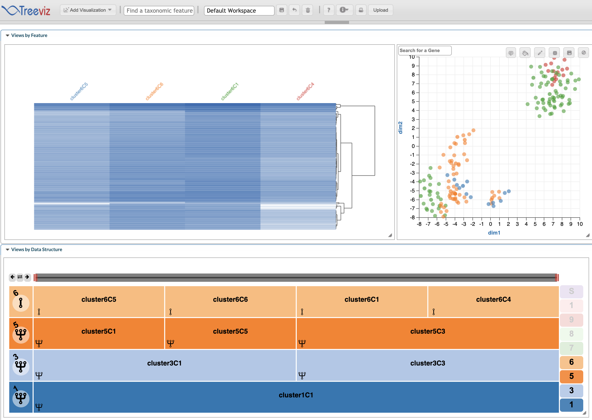

  
```{r setup, include = FALSE}
knitr::opts_chunk$set(
  collapse = TRUE,
  comment = "#>"
)
```

# Introduction

[`Palmtree`](https://github.com/HCBravoLab/palmtree) is a package for interactive visualization and exploration of Single Cell RNA sequencing data. `Palmtree` provides methods for exploring hierarchical features (eg. clusters in single cell at different resolutions or taxonomic hierarchy in single cell datasets), while supporting other useful data visualization charts like heatmaps for expression and scatter plots for dimensionality reductions like UMAP or TSNE.

## Loading required packages

```{r load-packages, message=FALSE, warning=FALSE}
library(palmtree)
library(dplyr)
library(Seurat)
library(SC3)
library(scran)
library(scater)
library(clustree)
library(igraph)
library(scRNAseq)
```

# Preparing Datasets

The first step in using the `Palmtree` package is to wrap datasets into `TreeViz` objects. The `TreeViz` class extends `SummarizedExperiment` and provides various methods to interactively perform various operations on the underlying hierarchy and count or expression matrices. In this section, we show various ways to generate a `TreeViz` object either from existing Single Cell packages (SingleCellExperiment or Seurat) or from a raw count matrix and cluster hierarchy.

## From `SingleCellExperiment`

A number of Single cell datasets are available as `SingleCellExperiment` objects through the `scRNAseq` package, for this usecase, we use `LunSpikeInData` dataset. In addition, we calculate the dimensionality reductions; UMAP, TSNE and PCA from the functions provided in `scater` package. 

```{r, eval=FALSE, results='hide', warning=FALSE, error=FALSE, message=FALSE}
# load dataset
sce<- LunSpikeInData('416b')
# Normalization
sce <- logNormCounts(sce)
# calculate umap and tsne
sce <- runUMAP(sce)
sce<- runTSNE(sce)
sce<- runPCA(sce)
```

Similar to the `Seurat` methods, we provide `createFromSCE` function to create a `TreeViz` object from `SingleCellExperiment` object. Here, the workflow works in two ways:

1. If no cluster information is available in the `colData` of the `SingleCellExperiment` object, we create clusters at different resolutions using the `WalkTrap` algorithm by calling an internal function `generate_walktrap_hierarchy` and use this cluster information for visualization.

```{r, eval=FALSE, warning=FALSE, error=FALSE, message=FALSE}
treeViz <- createFromSCE(sce, reduced_dim = c("UMAP","PCA","TSNE"))
plot(treeViz)
```

2. If cluster information is provided in the `colData` of the object, then the user should set the flag parameter `check_coldata` to `TRUE` and provide prefix for the columns where cluster information is stored.

```{r, eval=FALSE, warning=FALSE, error=FALSE, message=FALSE}
# Forming clusters
for (i in  seq(10)) {
  clust.kmeans <- kmeans(reducedDim(sce, "TSNE"), centers = i)
  sce[[paste0("clust", i)]] <- factor(clust.kmeans$cluster)
}

treeViz<- createFromSCE(sce, check_coldata = TRUE, col_regex = "clust")
plot(treeViz)
```

Note: In both cases the user needs to provide the name of dimensionality reductions present in the object as a parameter.

## From `Seurat`

We use the dataset `pbmc_small` available through Seurat to create a `TreeViz` object.  

```{r, eval=FALSE, echo=TRUE, results='hide', warning=FALSE, error=FALSE, message=FALSE}
data(pbmc_small)
pbmc <- pbmc_small
```

We then preprocess the data and find clusters at different resolutions.

```{r, eval=FALSE, echo=TRUE, results='hide', warning=FALSE, error=FALSE, message=FALSE}
pbmc[["percent.mt"]] <- PercentageFeatureSet(pbmc, pattern = "^MT-")
pbmc <- NormalizeData(pbmc)
all.genes <- rownames(pbmc)
pbmc <- ScaleData(pbmc, vars.to.regress = "percent.mt")
pbmc <- FindVariableFeatures(object = pbmc)
pbmc <- RunPCA(pbmc, features = VariableFeatures(object = pbmc))
pbmc <- FindNeighbors(pbmc, dims = 1:10)
pbmc <- FindClusters(pbmc, resolution = c(0, 0.1, 0.2, 0.3, 0.4, 0.5, 0.6, 0.7, 0.8, 0.9, 1.0), print.output = 0, save.SNN = TRUE)
pbmc
```

The measurements for dimensionality reduction methods we want to visualize are also added to the object via native functions in `Seurat`. Since `PCA` is already added, we calculate `TSNE` and `UMAP`
```{r, eval=FALSE, echo=TRUE, results='hide', warning=FALSE, error=FALSE, message=FALSE}
# pbmc<- RunTSNE(pbmc)
pbmc<- RunUMAP(pbmc, dims=1:3)
Reductions(pbmc)
```

We use the `createFromSeurat` function to create a `TreeViz` object from `Seurat` object. In addition the object, we pass the name of dimensionality reductions present in the object as a paramter in vector format to indicate these measurements should be added to `treeviz` for visualization. If the mentioned reduced dimension is not present it would simply be ignored.
```{r, eval=FALSE, echo=TRUE,  warning=FALSE, error=FALSE, message=FALSE}
treeViz<- createFromSeurat(pbmc, check_metadata = TRUE, reduced_dim = c("umap","pca","tsne"))
plot(treeViz)
```


## Create TreeViz from count matrix and Cluster hierarchy

```{r, eval=FALSE, results='hide', warning=FALSE, error=FALSE, message=FALSE}
n=64
# create a hierarchy
df<- data.frame(cluster0=rep(1,n))
for(i in seq(1,5)){
  df[[paste0("cluster",i)]]<- rep(seq(1:(2**i)),each=ceiling(n/(2**i)),len=n)
}

# generate a count matrix
counts <- matrix(rpois(6400, lambda = 10), ncol=n, nrow=100)

# create a `TreeViz` object
treeViz <- createTreeViz(df, counts)
plot(treeViz)
```

## Visualize gene expression across clusters

## Start the TreeViz App (using hosted app)

Start the App from the `treeViz` object we created. This adds a `facetZoom` to navigate the cluster hierarchy, a heatmap of the top `n` most variable genes from the dataset, where 'n' is selected by the user and one scatter plot for each of the reduced dimensions. 
 
```{r, eval=FALSE, echo=TRUE}
app <- startTreeviz(treeViz, top_genes = 500)
```



Users can also use the interface to explore the same dataset using different visualizations available through Epiviz.

## Adding Gene Box Plots

The users can also add Gene Box plots via the `Add Visualization` option in frontend, or from R session. In the following example, we visualize the 5th, 50th and 500th most variable gene as Box plot 


## Stop App

After exploring the dataset, this command the websocket connection. 

```{r, eval=FALSE, echo=TRUE}
app$stop_app()
```
## Start TreeViz with app running locally

```{r, eval=FALSE, echo=TRUE}
setTreevizStandalone()
app <- startTreevizStandalone(treeViz)
```
## Stop App

```{r, eval=FALSE, echo=TRUE}
app$stop_app()
```
