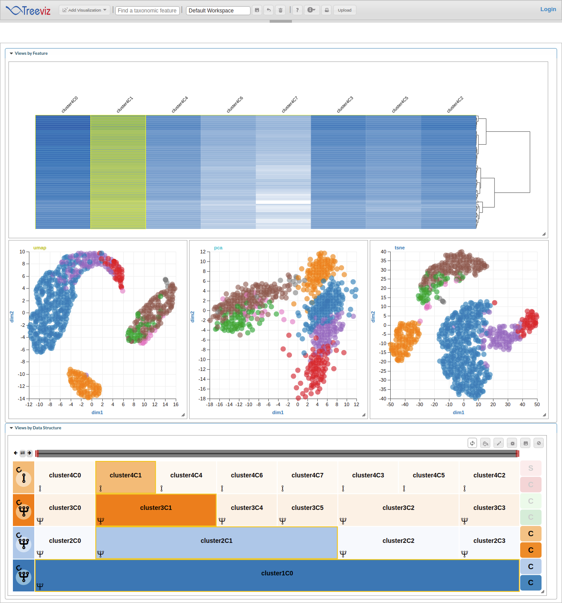
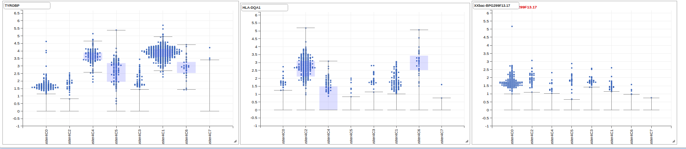

  
```{r setup, include = FALSE}
knitr::opts_chunk$set(
  collapse = TRUE,
  comment = "#>"
)
```

# Introduction

[`TreeViz`](https://github.com/HCBravoLab/TreeViz) is a package for interactive visualization and exploration of Single Cell RNA sequencing data. `TreeViz` provides methods for exploring hierarchical features (eg. clusters in single cell at different resolutions or taxonomic hierarchy in metagenomic datasets), while supporting useful data visualization charts like heatmaps for expression or count matrices and scatter plots for dimensionality reductions like UMAP or TSNE.

## loading required packages

```{r load-packages, message=FALSE, warning=FALSE}
library(TreeViz)
library(dplyr)
library(Seurat)
library(SC3)
library(scran)
library(scater)
library(clustree)
library(igraph)
library(scRNAseq)
```

# Preparing Datasets

The first step in using the `Treeviz` package is to wrap datasets into `TreeViz` objects. The `TreeViz` class extends `SummarizedExperiment` and provides various methods to interactively perform various operations on the underlying hierarchy and count or expression matrices. In this section, we show various ways to generate a `TreeViz` object either from existing Single Cell packages (SingleCellExperiment or Seurat) or from a raw count matrix and cluster hierarchy.

## From `SingleCellExperiment`

A number of Single cell datasets are available as `SingleCellExperiment` objects through the `scRNAseq` package, for this usecase, we use `LunSpikeInData` dataset. In addition, we calculate the dimensionality reductions; UMAP, TSNE and PCA from the functions provided in `scater` package. 

```{r, results='hide', warning=FALSE, error=FALSE, message=FALSE}
# load dataset
sce<- LunSpikeInData('416b')
# Normalization
sce <- logNormCounts(sce)
# calculate umap and tsne
sce <- runUMAP(sce)
sce<- runTSNE(sce)
sce<- runPCA(sce)
```

Similar to the `Seurat` methods, we provide `createFromSCE` function to create a `TreeViz` object from `SingleCellExperiment` object. Here, the workflow works in two ways:

1. If no cluster information is available in the `colData` of the `SingleCellExperiment` object, we create clusters at different resolutions using the `WalkTrap` algorithm by calling an internal function `generate_walktrap_hierarchy` and use this cluster information for visualization.

```{r, warning=FALSE, error=FALSE, message=FALSE}
treeViz <- createFromSCE(sce, reduced_dim = c("UMAP","PCA","TSNE"))
plot(treeViz)
```

2. If cluster information is provided in the `colData` of the object, then the user should set the flag parameter `check_colData` to `TRUE` and provide prefix for the columns where cluster information is stored.

```{r, warning=FALSE, error=FALSE, message=FALSE}
# Forming clusters
for (i in  seq(10)) {
  clust.kmeans <- kmeans(reducedDim(sce, "TSNE"), centers = i)
  sce[[paste0("clust", i)]] <- factor(clust.kmeans$cluster)
}

treeViz<- createFromSCE(sce, check_colData = TRUE, col_regex = "clust")
plot(treeViz)
```

Note: In both cases the user needs to provide the name of dimensionality reductions present in the object as a parameter.


## From `Seurat`

We use the dataset `pbmc_small` available through Seurat to create a `TreeViz` object.  

```{r, eval=TRUE, echo=TRUE, results='hide', warning=FALSE, error=FALSE, message=FALSE}
data(pbmc_small)
pbmc <- pbmc_small
```

Optionally depending on the dataset, users can preprocess data, perform normalization and find clusters at different resolutions to generate a hierarchy from `Seurat` objects. 

```{r, eval=FALSE, echo=TRUE, results='hide', warning=FALSE, error=FALSE, message=FALSE}
pbmc[["percent.mt"]] <- PercentageFeatureSet(pbmc, pattern = "^MT-")
pbmc <- NormalizeData(pbmc)
all.genes <- rownames(pbmc)
pbmc <- ScaleData(pbmc, vars.to.regress = "percent.mt")
pbmc <- FindVariableFeatures(object = pbmc)
pbmc <- RunPCA(pbmc, features = VariableFeatures(object = pbmc))
pbmc <- FindNeighbors(pbmc, dims = 1:10)
pbmc <- FindClusters(pbmc, resolution = c(0, 0.1, 0.2, 0.3, 0.4, 0.5, 0.6, 0.7, 0.8, 0.9, 1.0), print.output = 0, save.SNN = TRUE)
pbmc
```

The measurements for dimensionality reduction methods we want to visualize are also added to the object via native functions in `Seurat`. Since `PCA` is already available, we calculate `TSNE` and `UMAP`

```{r, eval=FALSE, echo=TRUE, results='hide', warning=FALSE, error=FALSE, message=FALSE}
pbmc<- RunTSNE(pbmc)
pbmc<- RunUMAP(pbmc, dims=1:3)
Reductions(pbmc)
```

We provide the `createFromSeurat` function to create a `TreeViz` object from `Seurat` object. In addition, we can also provide the name of dimensionality reductions present in the object as a parameter to indicate these dimensions also be wrapped in the `treeviz` object for visualization. 

Note: If the reduced dimension is not present it would be ignored.

We use the `createFromSeurat` function to create a `TreeViz` object from `Seurat` object. In addition the object, we pass the name of dimensionality reductions present in the object as a paramter in vector format to indicate these measurements should be added to `treeviz` for visualization. If the mentioned reduced dimension is not present it would simply be ignored.
```{r, eval=TRUE, echo=TRUE,  warning=FALSE, error=FALSE, message=FALSE}
treeViz<- createFromSeurat(pbmc, check_metaData = TRUE, reduced_dim = c("umap","pca","tsne"))
plot(treeViz)
```


## Create TreeViz from count matrix and Cluster hierarchy

```{r, results='hide', warning=FALSE, error=FALSE, message=FALSE}
n=64
# create a hierarchy
df<- data.frame(cluster0=rep(1,n))
for(i in seq(1,5)){
  df[[paste0("cluster",i)]]<- rep(seq(1:(2**i)),each=ceiling(n/(2**i)),len=n)
}

# generate a count matrix
counts <- matrix(rpois(6400, lambda = 10), ncol=n, nrow=100)

# create a `TreeViz` object
treeViz <- createTreeViz(df, counts)
plot(treeViz)
```

# Interactively explore `TreeViz` object

## Start the TreeViz App (using hosted app)

We provide `startTreeViz` method to initialize interactive exploration of data from the `treeViz` object we created before. 

```{r, eval=FALSE, echo=TRUE}
app <- startTreeviz(treeViz, top_genes = 500)
```

This process

1. Opens the browser (http://epiviz.cbcb.umd.edu/treeviz) 
2. Adds a `facetZoom` visualization to navigate the cluster hierarchy
3. Heatmap of the top `n` (default to 100) most variable genes from the dataset
4. Scatter plots for each of the reduced dimensions available in the object.  
 

 
In addition, users can also use the application UI to explore the same dataset using different visualizations available through TreeViz.

## Visualize gene expression across clusters

Users can add Box plots per gene through either the `Add Visualization` button in frontend, or from the R session using the `plot_gene` function. 

```{r, eval=FALSE, echo=TRUE}
# to add a box plot of expression for a gene
app$plot_gene(gene="TYROBP")
```
## Start TreeViz with app running locally

Here, we visualize the 5th, 50th and 500th most variable gene as Box plot,



## Stop App

After exploring the dataset, this command closes the app and the websocket connection. 

```{r, eval=FALSE, echo=TRUE}
app$stop_app()
```

## Start TreeViz with app running locally

```{r, eval=FALSE, echo=TRUE}
setTreevizStandalone()
app <- startTreevizStandalone(treeViz)
```
## Stop App

```{r, eval=FALSE, echo=TRUE}
app$stop_app()
```